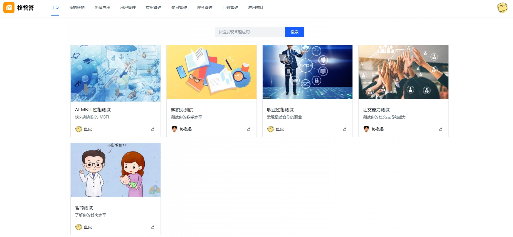
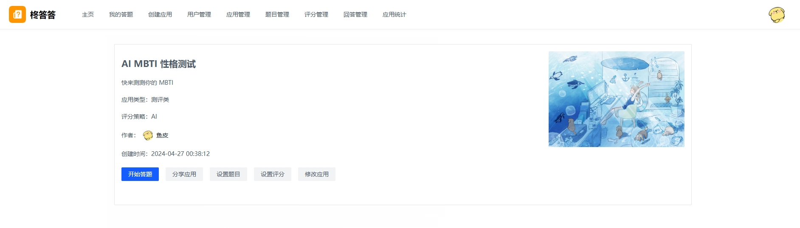
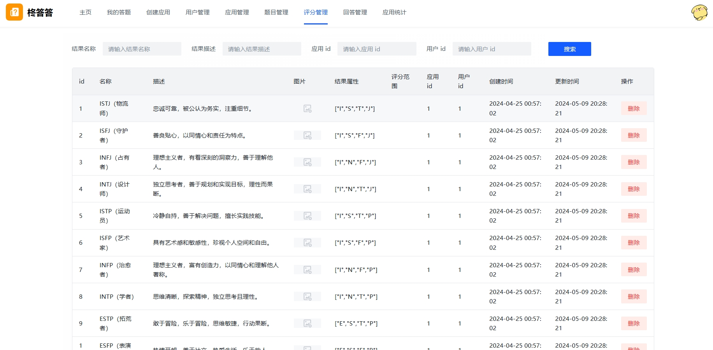
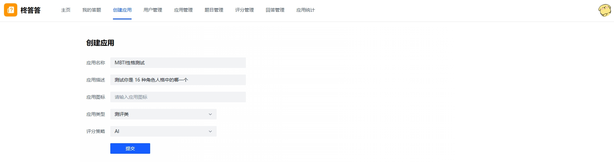
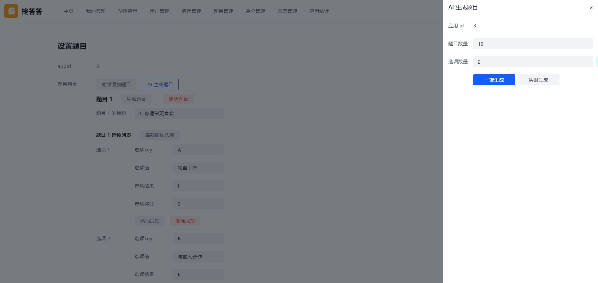
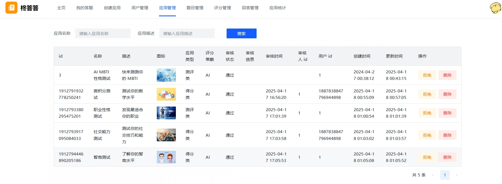
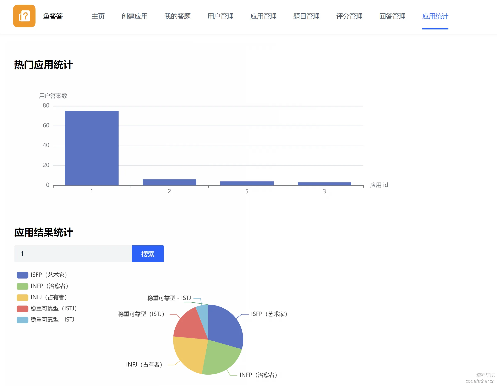
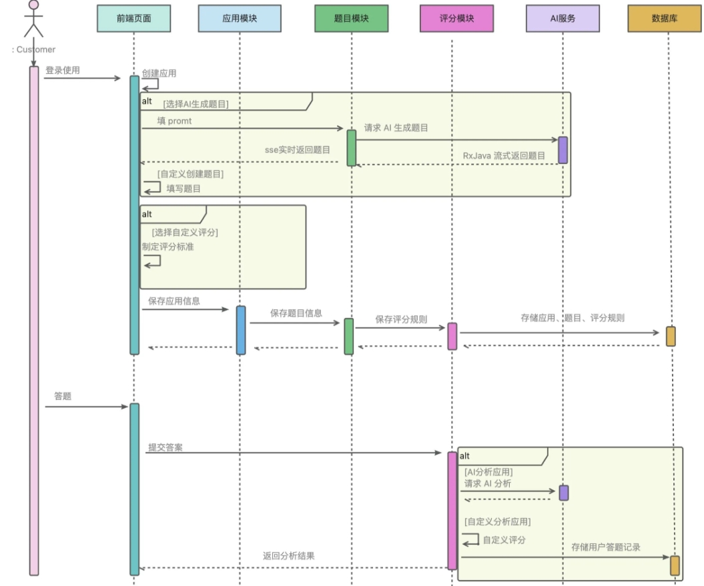

# ZhongDaDa AI 答题应用平台

## 项目简介
ZhongDaDa 是一个综合性的 AI 答题应用平台，包含 Web 端、小程序端和后台管理系统。平台提供智能答题、MBTI 性格测试等功能，为用户提供个性化的学习和测试体验。

## 项目结构
项目采用前后端分离架构，包含以下主要模块：

- `zhongdada-frontend`: Vue.js 前端项目
- `zhongdada-backend`: Spring Boot 后端服务
- `mbti-test-mini`: 微信小程序项目

## 技术栈

### 前端技术栈
- Vue.js 3.x
- TypeScript
- Element Plus
- Vite
- Axios
- Vue Router
- Pinia

### 后端技术栈
- Spring Boot
- MyBatis-Plus
- MySQL
- Redis
- Swagger

### 小程序技术栈
- Taro
- TypeScript
- Taro UI
- Redux

## 项目功能

### Web 端
- 用户注册登录
- 智能答题系统
- 答题历史记录
- 个人中心
- 管理员后台

### 小程序端
- MBTI 性格测试
- 测试结果分析
- 用户数据统计
- 社交分享功能

## 快速开始

### 环境要求
- Node.js >= 16.x
- JDK >= 1.8
- MySQL >= 5.7
- Redis >= 6.0
- Maven >= 3.6

### 前端启动
```bash
cd zhongdada-frontend
npm install
npm run dev
```

### 后端启动
```bash
cd zhongdada-backend
mvn clean install
mvn spring-boot:run
```

### 小程序开发
```bash
cd mbti-test-mini
npm install
npm run dev:weapp
```

## 项目截图
1. Web 端首页截图

2. 题目详情页面

3. 答题界面

4. 评分管理页面

5. 创建题目页面

6. AI生成题目页面

7. 应用管理页面

8. 应用统计页面


## 业务流程图



